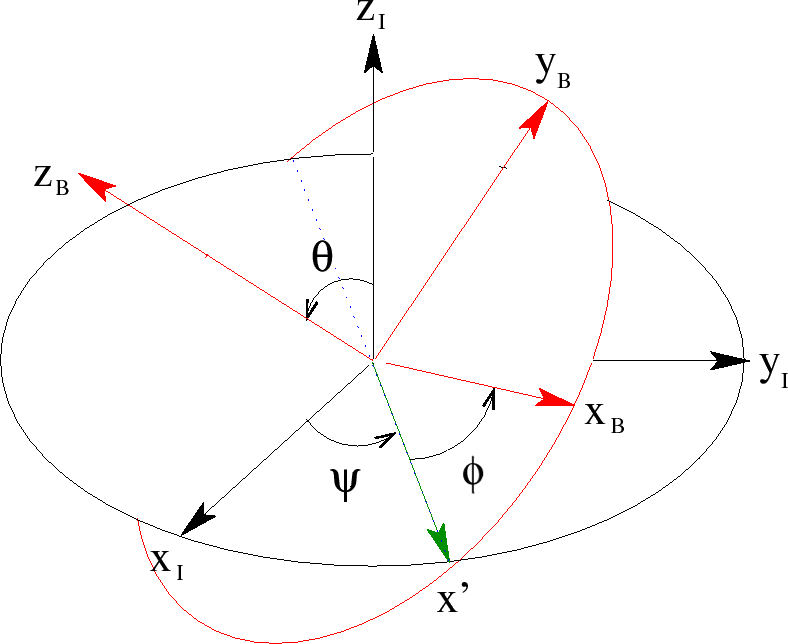
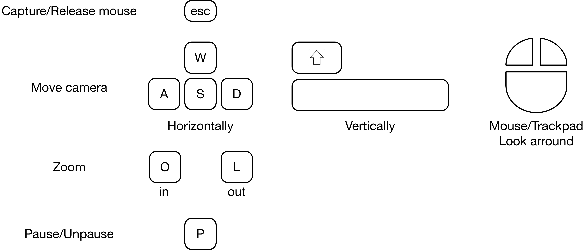

# Projet de simulation d'une Toupie

Authors: Tanish Patil and Yannis Ulrich.

## Help for application use

A general step-by-step instruction list is available inside the app. Here is some additonal information about the tops, the integrators, the parameters, and the plotable values. 
### Tops
Four tops can be simulated on a table with this application. They are:
* A simple cone, whose apex is fixed in a point on the table. It is caracterized by its mass, radius and length/height.
* A rolling tippe top, i.e. a tippe top for which friction is always assumed static. It is modelled as a truncated sphere. It's caracterised by its radius and the height that was truncated off. You can calculate the distance between sphere center and center of mass to be 3 \* h^2/(4*(R+h)), where R is the radius and h is the truncated off height. This top will not turn around, and only serves the rather niche purpose of demonstrating this fact. 
* A slipping tippe top, for which friction is assumed kinetic. The friction is assumed proportional to the tables reaction force. For this tippe top, you may additionally directly specify the radius and the distance between center of mass and center of sphere. 
* A slipping top, modelled as a disk of mass set on top of a massless rod. You may set the radius of the disk and the length of the rod, as well as the coefficient of friction. 

### Integrators
To integrate the equations of motion, different integrators are implemented. For the simple cone and rolling tippe top, whose equations are rather simple, you may use one of three integrators:
* Euler-Cromer
* Newmark
* Explicit Runge-Kutta of order 4
I will not explain what these are here, but if you are unsure which to choose: Euler-Cromer usually works fine, but if you think you system is diverging too quickly use Runge-Kutta. If you are interested in specifying exact relative errors, inform yourself about the Newmark integrator. 

For the two slipping tops, the equations happen to become stiff rather quickly with the above integrators. Thus a variable step-size adaptive LSODA integrator was implemented for these, and is the only possible choice. You do not need to set it.  

### Parameters
The three angles are Euler angles, and are to be given in radians. The other physical parameters have units indicated. The euler angles follow the convention on figure 1. Psi and phi may be switched from what you are used to. Apostrophes indicate time derivatives. This means that for a primitive test all parameters you really need to set are θ, i.e. how straight your top is, and φ', how fast you let it spin.

 
 
 <b>Figure 1: Euler angle convention. Credit https://hepweb.ucsd.edu/ph110b/110b_notes/node31.html, modified.</b> 
  

Mass means exactly what one would think: it's the mass of the top. For the remaining parameters, the information is specific to each top:
* For the cone, physical parameters are very intuitive. R is the radius of the base, and L is the height. X and y parameters define the position in the plane of the cone's apex. The speeds are ignored, as the position is assumed fixed. Also, friction is always static in this case and thus the μ parameter also doesn't apply. 
* For the rolling tippe top, R is the radius of the sphere, and h is the height that was truncated off the sphere (see description of tops for details). This parameter is covariant with the distance between geometric sphere center and center of mass.
* For the slipping Tippe top, R is again the radius of the sphere. In this case, ε represents the distance from the geometric sphere center to the center of mass. Here, μ is the friction coefficient. 
* For the slipping top, L is the length of the central rod, and R the radius of the homogenous disk on top of it (see top description for what these are). Again, μ is the friction coefficient.

### Plottable values
Finally, let us discuss the plottable values, which you may choose by ticking appropriate boxes in the app. 
* Energy is the total mechanical energy of the top, i.e. kinetic + potential. It should stay constant for the cone and the rolling tippe top, and decrease for the other two due to friction. 
* LA3 is the projection of the angular moment onto the top's rotational symetry axis. It is not plottable for the tippe tops, as it is not physically conserved for them.
* LAz is the projection of the angular moment onto the vertical axis. It is not plottable for the slipping tippe top, as it's not conserved for it.
* a \* (w x L) is a bit weird, and implemented because the project rules ask for it for the fixed cone. Its value is 0 when the top's rotational symetry axis, the angular momentum, and the angular velocity are coplanar. The issue is that for the cone, this is always the case, regardless of the precision of the simulation, so this parameter is effectively always 0. It is not defined for the other tops.

Now that all is set, here are the controls you may use during the simulation:

 
 
 <b>Figure 1: Controls during simulation.</b> 
  

